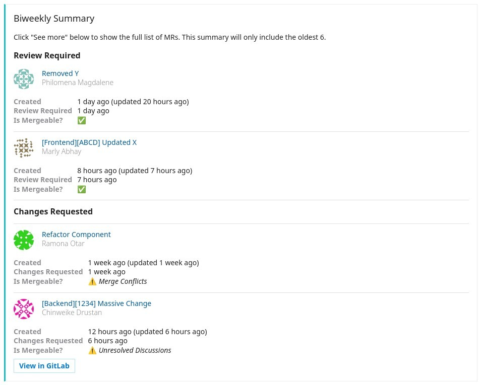

# gitlab-mr-summary

📰 A simple Google Cloud Function in Go to report a summary of GitLab merge requests to Microsoft Teams - it can be triggered regularly using Cloud Scheduler.

_(Screenshot above is only for illustration purposes. Actual results may vary.)_

---

**Why is this needed?**

For a small to medium-sized team, it can be hard to keep track of merge requests requiring attention or in limbo.

This function can be used to publish a "Biweekly Summary" to a Microsoft Teams channel, collating a breakdown of merge requests requiring review or requiring changes. It also includes how long a merge request has been in a specific state, and when it was created / updated.

This is not recommended for larger teams or for projects with lots of merge requests (> 20 at any given time).

**How does this work?**

1. This function will retrieve opened, and non-WIP merge requests using the configured `GITLAB_API_TOKEN`, and `GITLAB_PROJECT_ID`.
2. For each merge request, if it has labels, the function will fetch all label events related to it.
3. It will then summarise all the information for the merge request using (1), and (2). e.g. If it has ongoing discussions; if it has merge conflicts; how long it has been in a specific state (based on when the related label was added).
4. It will create a `MessageCard` webhook, and post it to the configured `TEAMS_WEBHOOK_URL`

## Getting Started

### Prerequisites

- Ensure you have `gcloud` installed:
    - MacOS: `brew cask install google-cloud-sdk`
    - Others: https://cloud.google.com/sdk/gcloud
- Ensure you have authenticated with Google Cloud: `gcloud init`
- (Optional) Set your current working project: `gcloud config set project <project>`
- This function assumes you use two GitLab labels for your target project: "Changes requested" and "Review required" (this is not currently configurable, but you can change them in `function.go`) 

### Deployment

1. Clone / download a copy of this repository
2. Copy `.env.sample.yaml` to `.env.yaml`, and modify the environment variables declared in the file
3. Run `./deploy.sh` _(recommendation: do not allow unauthenticated requests, see section on Cloud Scheduler below for more information)_

### Setting Up Cloud Scheduler

Optionally, if you would like to report a summary regularly (cron), modify, and run `./create_scheduler.sh` to create the necessary resources.
Unlike `./deploy.sh` which you can run multiple times, you should only run `./create_scheduler.sh` once.
This script will also set-up a service account which will be used to securely invoke the Cloud Function, without exposing it to the internet (specifically, preventing unauthenticated requests).

Alternatively, you can also set-up Cloud Scheduler manually via the [web UI](https://console.cloud.google.com/cloudscheduler) or through _infrastructure-as-code_, e.g. [Terraform](https://registry.terraform.io/providers/hashicorp/google/latest/docs).
